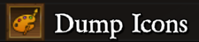
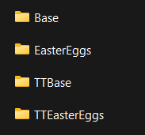

# RoleIconRecolors
The mod adds a bit of flair to icons!

**How to set your own icons**
- Step 1: In the main menu, go to *Mod Actions* and dump the mod assets. There will be a tiny lag spike, no worries because it's just dropping the mod's assets into a folder
- Step 2: When the file explorer opens, you will see 4 folders: *Base*, *TTBase*, *EasterEggs* and *TTEasterEggs*
- Step 3: Explore these folders however you wish
- Step 4: Look for the image you want to replace, if it's there then it can be replaced in most places in the game. Please note the name of the image (eg. Mayor_Special) and the name of the folder it is in
- Step 5: Go backwards in your file explorer till you see only one folder by the name of *Default*
- Step 6: Create a folder and name it whatever you want
- Step 7: Enter your newly made folder and create another folder that your desired image will be in
- Step 8: Drop your own image into the newly made subfolder and rename the image to that of the image you want to replace. Note: the image must be a png (for now)
- Step 9: Open the game and go into the mod's settings
- Step 10: Change the value of the *Selected Icon Pack* setting from *Default* to the name of the first folder you made. Remember that this is case and character sensitive, so make sure the value matches the name of the folder
- Step 11: Close the SML menu. There might be a slight lag spike whose length depends on how many images you put in (as it's loading all of those images if the value was input correctly)
- Step 12: Enjoy (hopefully)!

If it you didn't understand the instructions, here's an example on how to do it

First, you open the game and dump the mod assets

After a lag spike, it should open your operating system's file explorer

Now I want to replace Mayor's base role icon with Admirer's and I will go into the `Base` folder and look for the Mayor and Admirer icons

So I will note the file's name, which in this case is `Mayor` and the folder it's in, which here is `Base`

Now I will go up the folders, kind of like going in reverse where I'm exiting a folder instead of entering it. I will keep doing it till I see a `Default` folder in the list. In that directory I will now create a new Icon Pack folder called `Test`

And then enter the folder and create the `Base` folder which I had noted earlier. I will now drop my Admirer icon into this base folder and rename it to `Mayor`

Once the filing has been completed, I will go back into the game and navigate to the mod's settings and change the value for "Selected Icon Pack" to "Test"

Once that's done, I'll just enter into a game where I get Mayor and bam! It works

