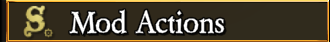
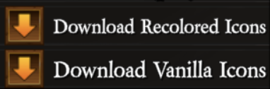
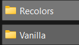
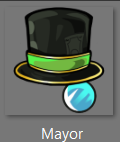
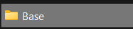
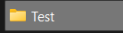
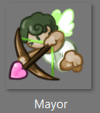
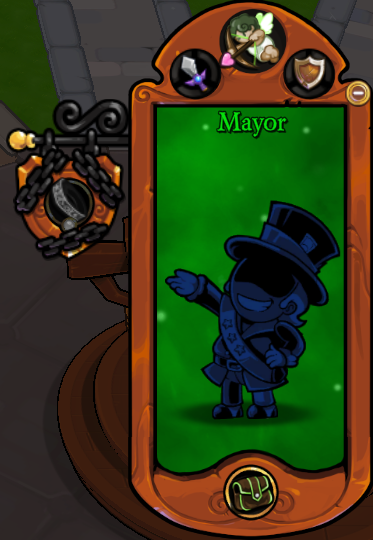

# RoleIconRecolors
The mod adds a bit of flair to icons!

**How to set your own icons**
- Step 1: In the main menu, go to `Mod Actions` and click on the `Download Vanilla Icons` and `Download Recolors Icons`. Wait a while as the mod downloads the required icons. Once the download is complete, it should open a file explorer window to your desired window. If not, you can navigate to it by opening the mods folder, going back one folder and then into `ModFolders` then `Recolors` folders.
- Step 2: The `Vanilla` folder contains the vanilla images. These can be used as a basis for your icon pack (like what x role but it was blue?) To actually make your own icon pack, explore the `Recolors` folder.
- Step 3: In the `Recolors` folder, you will see 4 folders: `Base`, `TTBase`, `EasterEggs` and `TTEasterEggs`. `Base` is where your main icons will go. These will be the primary ones to replace your role's icons in all modes and other interfaces. `TTBase` is the folder where your alternate icons for town roles will go. These icons will only appear in the town traitor mode, and only when you are the traitor. These icons (if any) will replace the role icon with an edited version to show that you are the traitor. The icons in `EasterEggs` and `TTEasterEggs` have a small, random and customisable chance of replacing the targeted icon.
- Step 4: In the `Recolors` folder, look for the image you want to replace, if it's there then it can be replaced in most places in the game. Please note the name of the image and the name of the sub folder it is in.
- Step 5: Go backwards in your file explorer till you see either the `Vanilla` or `Recolors` folder (or both).
- Step 6: Create a folder for your icon pack and name it whatever you want. Note this name.
- Step 7: Enter your newly made folder and create another folder that your desired image will be in. This folder needs to be named one of the 4 subfolders mentioned above.
- Step 8: Drop your own image into the newly made subfolder and rename the image to that of the image you want to replace.
- Step 9: Open the game and go into the mod's settings
- Step 10: Change the value of the `Selected Icon Pack` setting from `Vanilla` or `Recolors` to the name of your icon pack.
- Step 11: Close the SML menu. There might be a slight lag spike whose length depends on how many images you put in (as it's loading all of those images if the value was input correctly).
- Step 12: Enjoy (hopefully)!

**Certain rules for icon packs**
- Images must be 256x256.
- Images must be png.
- The value for the `Selected Icon Pack` is case and character sensitive. Ensure you have the name down correctly, letter for letter to ensure it works.

If it you didn't understand the instructions, here's an example on how to do it.

First, I will open the game and download the recolors and vanilla assets.

After a while (doesn't matter how long, but typically 5-6 mins), a file explorer window should open for me showing me either the `Vanilla` or `Recolors` folder (or both).

Now I want to replace Mayor's role icon with Admirer's and I will go into the `Recolors` then `Base` folders and look for the Mayor and Admirer icons.

So I will note the file's name, which in this case is `Mayor` and the folder it's in, which here is `Base`.

Now I will go up the folders, kind of like going in reverse where I'm exiting a folder instead of entering it. I will keep doing it till I see the `Vanilla` or `Recolors` folder in the list. In that directory I will now create a new Icon Pack folder called `Test`.

And then enter the folder and create the `Base` folder which I had noted earlier. I will now drop my Admirer icon into this base folder and rename it to `Mayor`.

Once the filing has been completed, I will go back into the game and navigate to the mod's settings and change the value for `Selected Icon Pack` to `Test`.

Once that's done, I'll just close the SML menu and enter a game where I get Mayor. It works.

